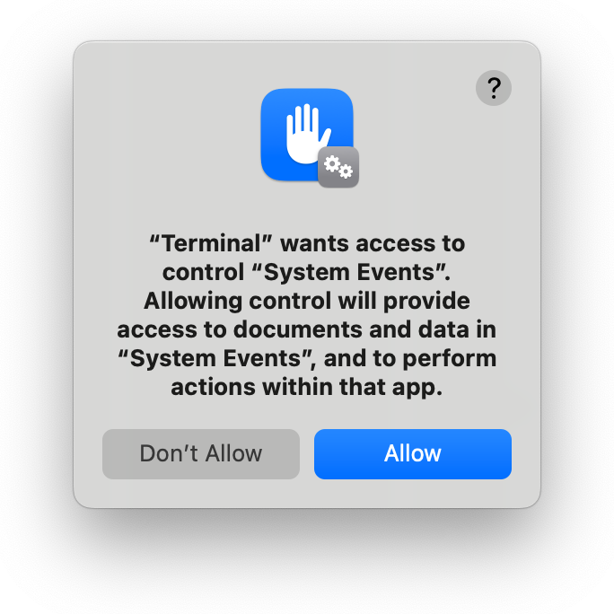
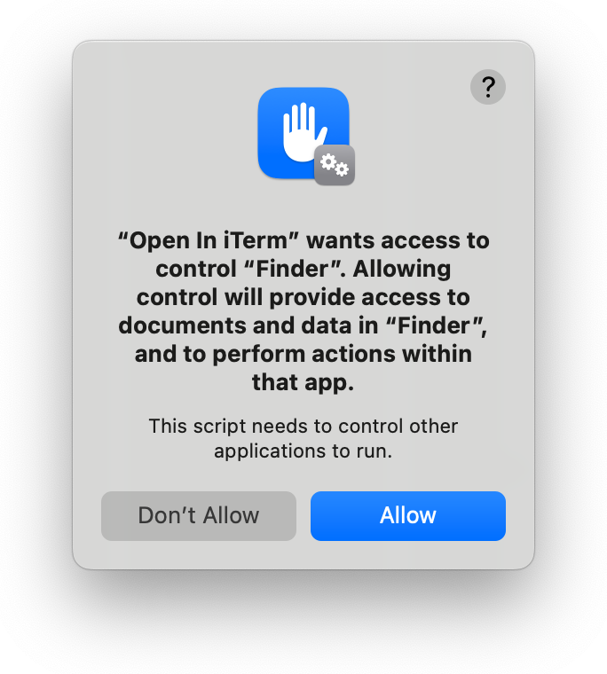
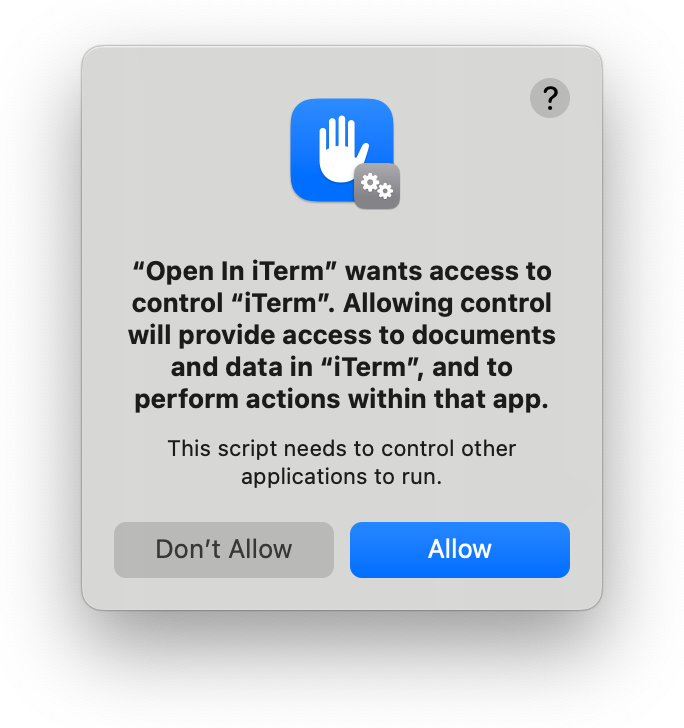

It's often handy to switch between looking at a folder's contents in Finder, and running command-line utilities in it. You can switch from command-line to GUI by running `open .` to view your shell's working directory in Finder, but there is no built-in utility to do the reverse.

That's why this app exists. After installing it as a Finder toolbar button, you can click the icon in (just about) any Finder window to open a new [iTerm](https://iterm2.com) tab, with your shell's working directory automatically switched to the Finder window's folder. Or you can hold the **fn** or **shift** key down as you click, to open the folder in a new iTerm window, instead of a new tab.

If you prefer Apple's Terminal app, see [Open in Terminal](https://github.com/jakshin/open-in-terminal).


## Usage

Once the app is installed, each of your Finder windows will contain the its icon. Just click the icon to open the Finder window's folder in iTerm. You can also launch the app in other ways, such as through Spotlight, and it will use the folder displayed in your frontmost Finder window.

A small wrapper script named `iterm` is also provided, which invokes the app to open a new iTerm tab or window displaying a given directory. This can be handy if you use both Terminal and iTerm. Run `iterm --help` for usage details.


## Installation

### Step 1: Get the code and build the app

Either clone the repo, or download it and extract the zip file.   
Then run `build.sh`, which will create `Open In iTerm.app`.

The build script tries to detect whether you have macOS's dark mode enabled, to decide which icon to build the app with, so you may see a popup asking to grant Terminal access to control System Events. If you say no (or if you've previously declined to grant Terminal this access), the build script will use the light-mode icon by default. You can pass the `--dark` or `--light` option to the build script to manually select an icon, avoiding the need for the script to try to detect dark mode.

<div align="center">
	
</div>

### Step 2: Allow automation access

Launch the app for the first time, while holding the **fn** or **shift** key down. You'll see a series of popups asking to grant it access to control Finder, System Events, and iTerm. You'll need to allow each, or Open In iTerm won't be able to do its thing:

 <div align-"center">
 	
 	
 	
 </div>

If you accidentally don't allow access to any of these apps, you can fix it in **System Settings**, on the **Privacy & Security > Automation** screen:   
![[Screenshot of Automation settings]](screenshots/automation-settings.png)

### Step 3: Drag the application into your Finder toolbar

Hold the **command** key down and drag `Open In iTerm.app` into your Finder toolbar:   
![[Screenshot of holding Command and dragging]](screenshots/hold-command-and-drag.png)

### Step 4: Install the wrapper script (optional)

Copy or symlink the `iterm` wrapper script to a directory that's in your shell's path, or add the directory it's in to your path. For example, to create a symlink in `/usr/local/bin`, run this from the directory containing the script:

```bash
[[ -d /usr/local/bin ]] || sudo mkdir -p /usr/local/bin
sudo ln -s "$(pwd -P)/iterm" /usr/local/bin/iterm
```


## Uninstallation

To uninstall the app, hold the **command** key down and drag its icon out of your Finder toolbar, then delete it.

If you installed the command-line `iterm` wrapper script, delete it and any symlinks to it.
